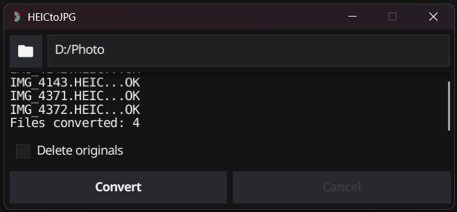

 
# HEICtoJPG 
___
HEICtoJPG is Windows app, that allows you to convert images from .HEIC to .JPG format.
It is built using [fyne](https://fyne.io/) and [jdeng goheif](https://github.com/jdeng/goheif)
libraries. All you need to do is to specify the folder and the app will find every
image with .HEIC extension and convert them to .JPG. It does not corrupt original files.


___
To build your own version use the following command:
```
go build -o HEICtoJPG.exe -ldflags "-H=windowsgui -w -s -extldflags '-static'" main.go
```
make sure that you have enabled C compiler. Read [this](https://docs.fyne.io/started/cross-compiling) for details

